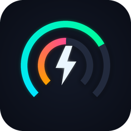
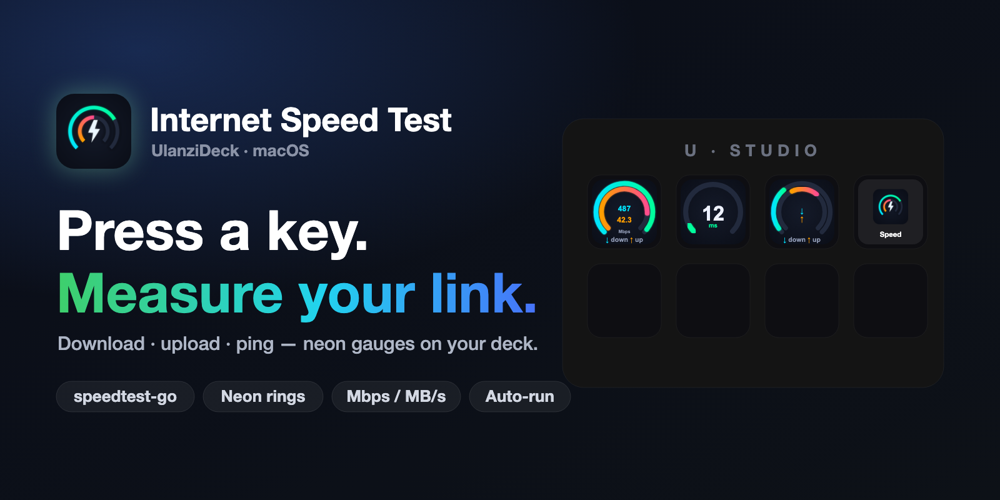
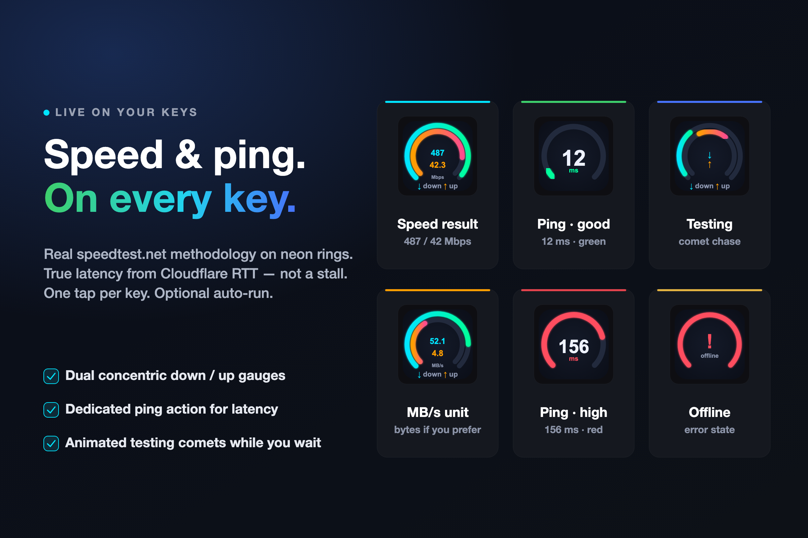
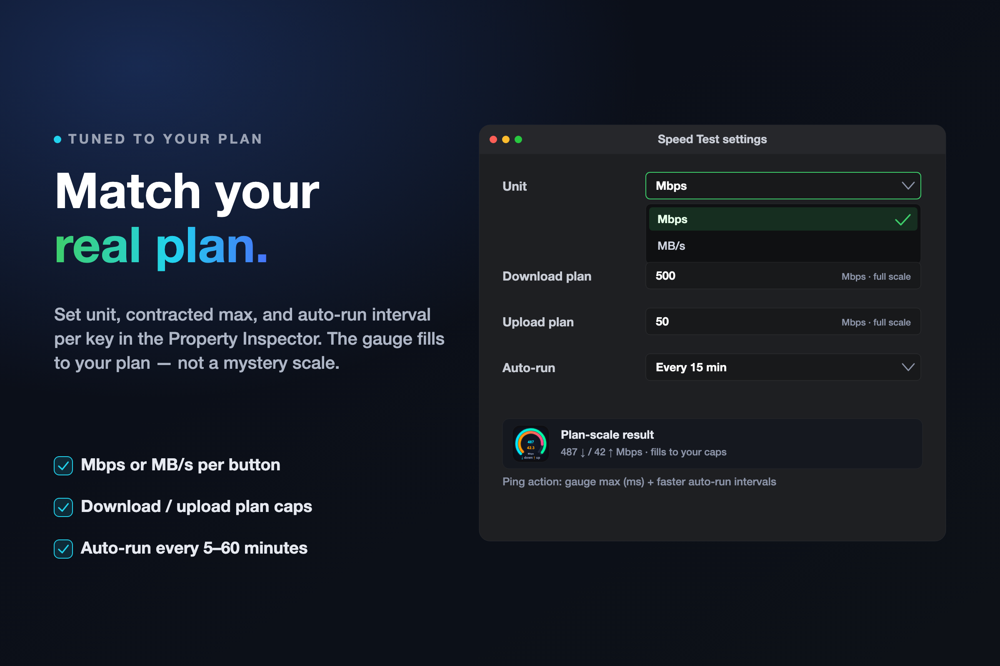

<p align="center">
  
</p>

# Internet Speed Test Plugin for Ulanzi Deck

[](https://ulanzicommunitystore.narlei.com/plugins/?plugin=narlei/ulanzideck-internet-speed-test)

Run a beautiful, accurate internet speed test right from your Ulanzi Deck — download, upload, and ping on neon gauges.



## Features

- **Speed Test action** — Measure download and upload with a real speedtest.net client (`speedtest-go`, same methodology as Ookla)
- **Ping action** — True latency at a glance via Cloudflare RTT (fast, no 30s stall)
- **Neon dual gauges** — Concentric rings for down / up with live numbers on the key
- **Plan scale** — Optional contracted download/upload max so the gauge fills to *your* plan
- **Units** — Mbps or MB/s per button
- **Auto-run** — Optional interval (minutes for speed test; seconds or minutes for ping)
- Color-coded ping (green → yellow → red) and animated “comet” loading while a test runs

## Actions

### Speed Test

Press the key to run a full download + upload test. Results render as dual neon rings with ↓ down / ↑ up in the center. Configure in the Property Inspector:

- **Unit** — `Mbps` or `MB/s`
- **Download plan** / **Upload plan** — Optional full-scale caps (blank = auto scale)
- **Auto-run** — Off, or every 5 / 15 / 30 / 60 minutes

### Ping

A dedicated latency key. Shows RTT in ms on a single gauge. Settings:

- **Gauge max (ms)** — Full scale for the ring (e.g. `200`)
- **Auto-run** — Off, or every 5s–60m



## Installation

Download the latest release from https://ulanzicommunitystore.narlei.com/plugins/?plugin=narlei/ulanzideck-internet-speed-test

## Requirements

- Ulanzi Deck / Ulanzi Studio 2.1.4 or later (3.0.11+ recommended)
- macOS 10.15+ or Windows 10+
- Network access (speed test uses `speedtest-go`; ping uses Cloudflare)

## How It Works

**Speed Test** shells out to the bundled `speedtest-go` binary (Ookla-compatible servers), then paints dual concentric neon arcs on the key via SVG icons.

**Ping** does *not* use speedtest-go’s slow ping mode. It samples Cloudflare’s `Server-Timing: cfL4` min RTT over a few quick requests and keeps the best value.

Both actions support optional auto-run and never overlap a test that is already running. Errors (offline, etc.) show a clear error state on the key.



## Developer Setup

```bash
make install   # symlink into local Ulanzi Deck plugins folder + restart
make package   # build distributable ZIP in dist/
```

## Author

Narlei Moreira

## License

MIT
